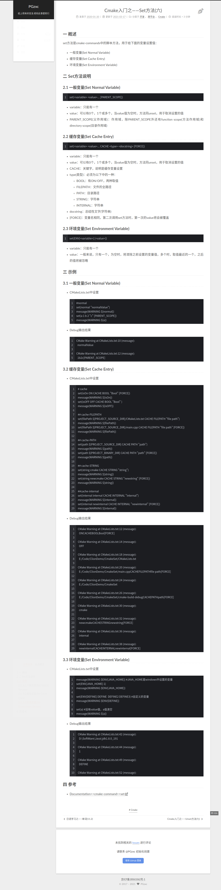

## set

```
1. 如果需要force生效，则[]是不必加的
2. 添加的变量值在CMakeCache.txt中
3. ENV之前不需要添加$符号
```
## option  
-- 编译脚本传递参数
[option 选项开关](https://blog.csdn.net/chouhuan1877/article/details/100808689)
## cmake中的一些预定义变量
  [cmake的基本参数和用法](https://blog.csdn.net/qq26983255/article/details/83303606) 
```
PROJECT_SOURCE_DIR 工程的根目录
PROJECT_BINARY_DIR 运行cmake命令的目录,通常是${PROJECT_SOURCE_DIR}/build
CMAKE_INCLUDE_PATH 环境变量,非cmake变量
CMAKE_LIBRARY_PATH 环境变量
CMAKE_CURRENT_SOURCE_DIR 当前处理的CMakeLists.txt所在的路径
CMAKE_CURRENT_BINARY_DIR target编译目录
使用ADD_SURDIRECTORY(src bin)可以更改此变量的值
SET(EXECUTABLE_OUTPUT_PATH <新路径>)并不会对此变量有影响,只是改变了最终目标文件的存储路径
CMAKE_CURRENT_LIST_FILE 输出调用这个变量的CMakeLists.txt的完整路径
CMAKE_CURRENT_LIST_LINE 输出这个变量所在的行
CMAKE_MODULE_PATH 定义自己的cmake模块所在的路径
SET(CMAKE_MODULE_PATH ${PROJECT_SOURCE_DIR}/cmake),然后可以用INCLUDE命令来调用自己的模块
EXECUTABLE_OUTPUT_PATH 重新定义目标二进制可执行文件的存放位置
LIBRARY_OUTPUT_PATH 重新定义目标链接库文件的存放位置
PROJECT_NAME 返回通过PROJECT指令定义的项目名称
CMAKE_ALLOW_LOOSE_LOOP_CONSTRUCTS 用来控制IF ELSE语句的书写方式
系统信息
CMAKE_MAJOR_VERSION cmake主版本号,如2.8.6中的2
CMAKE_MINOR_VERSION cmake次版本号,如2.8.6中的8
CMAKE_PATCH_VERSION cmake补丁等级,如2.8.6中的6
CMAKE_SYSTEM 系统名称,例如Linux-2.6.22
CAMKE_SYSTEM_NAME 不包含版本的系统名,如Linux
CMAKE_SYSTEM_VERSION 系统版本,如2.6.22
CMAKE_SYSTEM_PROCESSOR 处理器名称,如i686
UNIX 在所有的类UNIX平台为TRUE,包括OS X和cygwin
WIN32 在所有的win32平台为TRUE,包括cygwin
CMAKE_BUILD_TYPE 设置模式是Debug还是Release模式
CMAKE_C_FLAGS 设置C编译选项
CMAKE_CXX_FLAGS 设置C++编译选项
```
