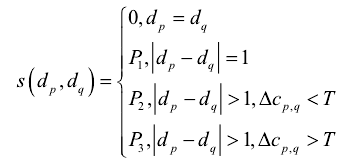
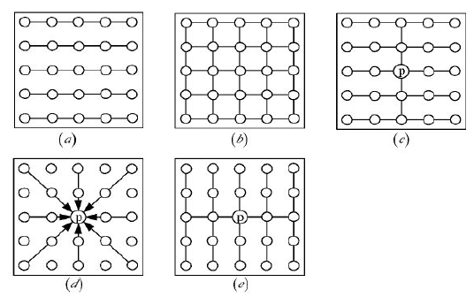
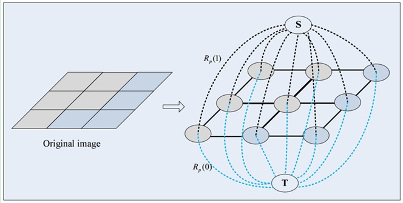

WTA: winner takes all
Disparity propagation (PatchMatch)
TAD: truncated absolute differences (TAD)
    e(x, y, d) = min{|Ir(x, y)-It(x+d, y)|, T}

## 双目视觉的基础
    视差加三角化
    极线约束
## 立体匹配的难点
    颜色/亮度差异和噪声
    反光区域
    倾斜面
    弱纹理区域
    重复纹理
    透明物体
    遮挡和不连续
    透视变形
## 匹配方法
    局部方法
    全局方法
        图割
        置信度传播
    半全局方法
        SGM
## 直接匹配的问题
    存在冗余计算
## 立体匹配流程
    匹配代价计算
    代价聚合
    视差计算
    视差优化/后处理
## 匹配代价计算
    AD/BT 灰度值相减， BT算法考虑了像素点的采样
    AD+Gradient 增加梯度
    census 进行二值编码，汉明距离
    NCC 向量余弦
    AD+Census 加权
    CNN   
## 代价空间和滑动窗口
    代价窗口可以减小滑动窗口的冗余计算
## 代价聚合
    在视差图上进行滤波
        均值滤波 双边滤波（可以保留边缘特性，窗口可以开的更大， 匹配更加稳定）
        cross-based local stereo matching 自适应阈值窗口
        sgm : 能量函数，考虑视差图的平滑性 动态规划算法加速
## 视差优化
    左右一致性检测
    speckle filter
    亚像素插值

## 端到端视差计算网络
    Disp-Net(2016)
    GC-Net(2017)
    iRestNet(2018)
    PSM-Net(2018)
    Stereo-Net(2018)
    GA-Net(2019)
    EdgejStereo(2020)

# 全局匹配算法
## 动态规划算法（dp）
    全局能量函数： E(d) = E(data) + E(smooth)
    E(data) = m(p, d) = sum(C(p,d)) 左像素与视差为d的右像素之间的匹配代价函数
    E(smooth) = sum(s(dp, dq))p,q 属于N
    N表示相邻像素对的集合，dp,dq分别代表两个相邻像素点的视差，s代表平滑项约束
    忽略了扫描线之间的视差约束，视差图有明显的条纹现象

    通过像素点间的相互约束的领域范围，产生几种树结构的DP算法
    基于控制点的双向动态规划匹配，通过事先确定的正确匹配点作为匹配控制点，在动态规划的过程中对寻优路径进行指导，降低复杂度，减少条纹瑕疵。

## 图割法
    图切割：将图像中的所有像素分配一系列对应标号的问题。依据：灰度、颜色、纹理、形状等特征
    基于阈值的图像分割方法
    基于边缘的分割方法
    基于区域的分割方法
    基于图论的分割方法
        分割后子图之间的相似度最低，子图之内的相似度最大
    基于能量泛函的分割方法

# 图割法

第一种顶点和边是：第一种普通顶点对应于图像中的每个像素。每两个邻域顶点（对应于图像中每两个邻域像素）的连接就是一条边。这种边也叫n-links。

第二种顶点和边是：除图像像素外，还有另外两个终端顶点，叫S（source：源点，取源头之意）和T（sink：汇点，取汇聚之意）。每个普通顶点和这2个终端顶点之间都有连接，组成第二种边。这种边也叫t-links。

 Graph Cuts中的Cuts是指这样一个边的集合，很显然这些边集合包括了上面2种边，该集合中所有边的断开会导致残留”S”和”T”图的分开，所以就称为“割”。如果一个割，它的边的所有权值之和最小，那么这个就称为最小割，也就是图割的结果

 图像分割可以看成pixel labeling（像素标记）问题，目标（s-node）的label设为1，背景（t-node）的label设为0，这个过程可以通过最小化图割来最小化能量函数得到。那很明显，发生在目标和背景的边界处的cut就是我们想要的（相当于把图像中背景和目标连接的地方割开，那就相当于把其分割了）。同时，这时候能量也应该是最小的。假设整幅图像的标签label（每个像素的label）为L= {l1,l2,,,, lp }，其中li为0（背景）或者1（目标）。那假设图像的分割为L时，图像的能量可以表示为：

E(L)=aR(L)+B(L)

       其中，R(L)为区域项（regional term），B(L)为边界项（boundary term），而a就是区域项和边界项之间的重要因子，决定它们对能量的影响大小。如果a为0，那么就只考虑边界因素，不考虑区域因素。E(L)表示的是权值，即损失函数，也叫能量函数，图割的目标就是优化能量函数使其值达到最小。
区域项：表示像素分配给标签时的惩罚，通过比较像素与前景与背景的灰度差来进行获得，一般采用对数进行计算
边界项：比较边界的分割特性，对于不连续性的惩罚，通过比较纹理颜色等确定不同的惩罚值。
最小的能量值对应于最佳的分割方式。

个人理解在立体匹配阶段：通过写数据匹配项代价与视差的连续性代价进行建立能量函数。