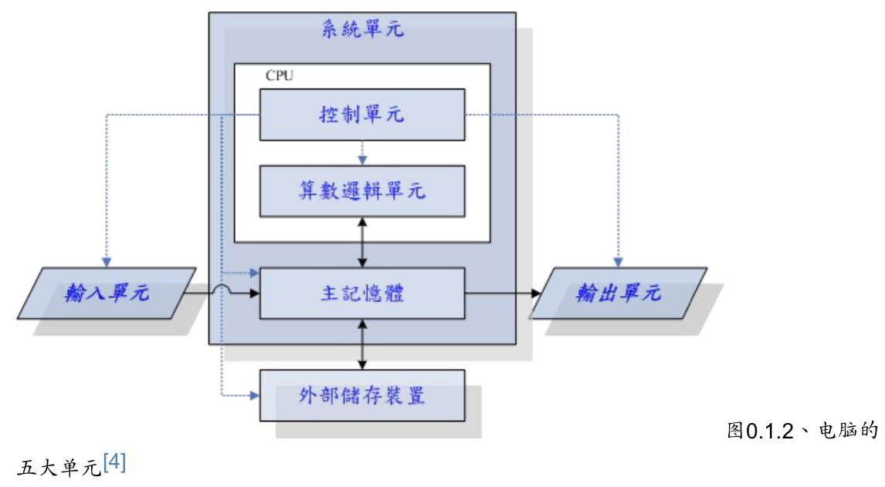
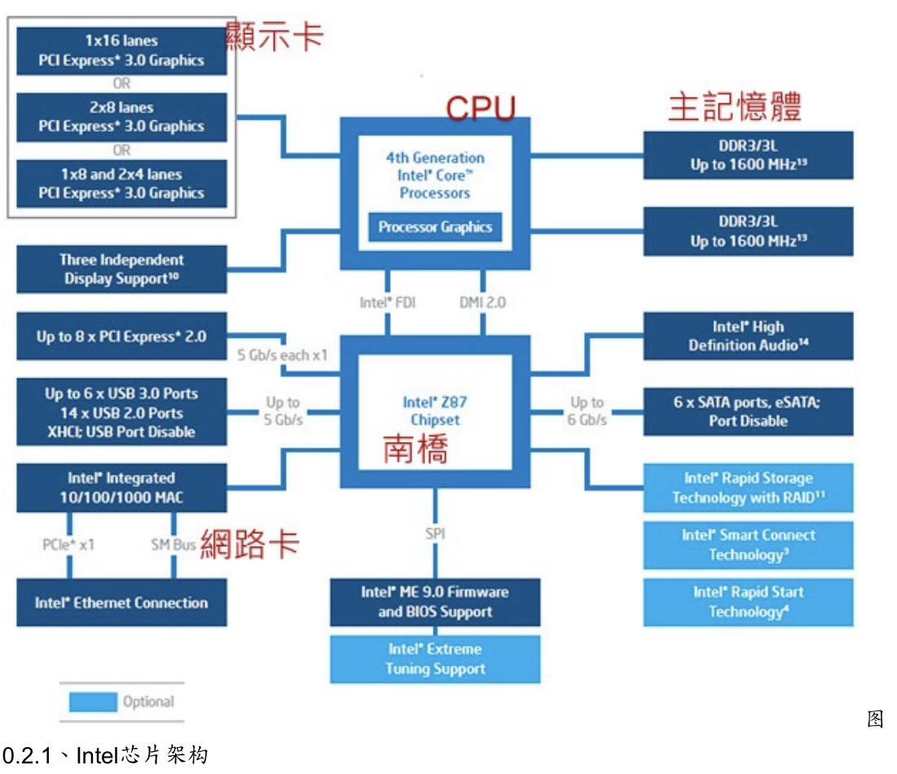

# **鸟哥的linux私房菜读书笔记**
# 计算机概论
计算机：接受使用者输入的指令与数据，经过中央处理器的数学与逻辑运算单元处理之后，以产生或者存储成有用的信息。

CPU:算数逻辑单元与控制单元

计算机的组成：输入单元、输出单元、CPU内部的算术逻辑单元以及控制单元、内存

CPU架构：精简指令集（RISC）和复杂指令集（CISC）

早期  
北桥：负责速度较快的CPU、显卡与内存等  
南桥：负责速度较慢的硬盘、USB、以及网卡等  
现在北桥内存控制器整合到CPU封装中了。

FSB（前端总线）的诞生是为了使得通过北桥连接的设备的工作频率都要相同。因为CPU运算速度快，为了同时协调外部器件与CPU，使用外频与倍频的概念  
外频：CPU与外部元件进行数据传输时的速度  
倍频：CPU用来加速工作性能的一个倍数  
超频：一般为改变外频

字组（word size）：cpu每次能够处理的数据量

内存  
DRAM:动态随机存取内存  
SRAM:静态随机存取内存 CPU内部，工作频率与CPU相同  
ROM:只读存取器 CMOS、固件（BIOS）  现在的BIOS一般在flash或者EEPROM，可以修改

设备地址I/O位址与IRQ中断  
I/O位址：每个设备的地址  
IRQ中断：通过IRQ中断信道告知CPU该设备的工作状况

CMOS:记录主板的重要参数，系统时间、CPU的电压与频率、各项设备的I/O位址与IRQ等，需要电池  
BIOS:开机执行程序

操作系统：管理电脑所有的活动以及驱动中所有的硬件;参考硬件规格直接写成。管理内容包括cpu、内存、输入输出设备以及文件系统文件  
系统调用：为了保护核心，也为了让程序设计师更加容易的设计开发软软件，提供的一组开发接口。与核心的联系比较密切，与硬件联系不大。  
操作系统的核心功能：系统调用接口、程序管理调度、内存管理、文件系统管理、设备的驱动

# 第一章、Linux是什么与如何学习

POSIX : 可携式操作系统接口，重点规范在核心与应用接口之间的规范

Linux的核心版本：

主版本号为奇数为测试版本，为偶数为稳定版本  
3.0之后不适用，通过分支确定长久支持版本

Linux distribution：Kernel + Softwares + Tools +可完整安装程序

分类：  
RPM安装方式， dpkg安装方式  
社区版和商业版

/var/log/目录下记录着计算机运行的一些信息

# 第二章、主机规划与磁盘分区